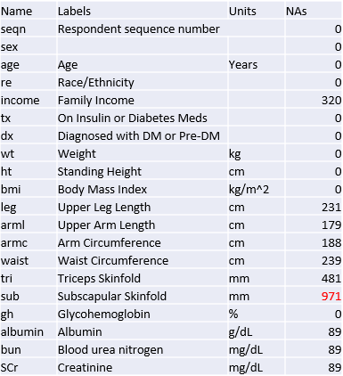
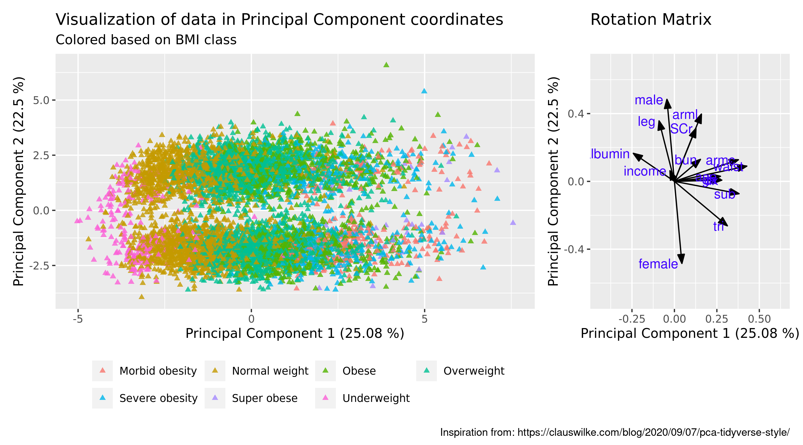

```{r setup, include=FALSE}
knitr::opts_chunk$set(echo = FALSE)
```

## Introduction
### How personal parameters influence diabetes diagnosis 

-  Is the diagnosis influenced by income and gender
-  Explore clustering patterns in the data
-  Is there specific variables related to if a person is treated


## NHANES glycohemoglobin data



## Methods
{width=100%}


## Principal Component Analysis
### Investigating patterns in relation to diagnosis of diabetes melltius

{width=100%}

## Principal Component Analysis
### Investigating of patterns in relation to BMI

{width=100%}


## K-means clustering 
### Identify relevant number of clusters
{width=100%}

## K-means clustering
### CLusters between age and all other variables
{width=100%}

## Conclusion 


