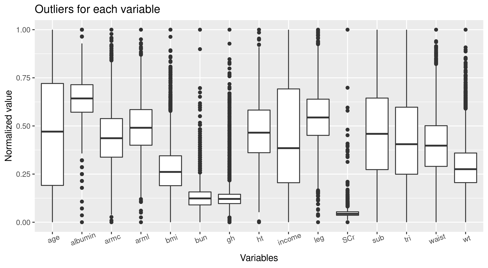
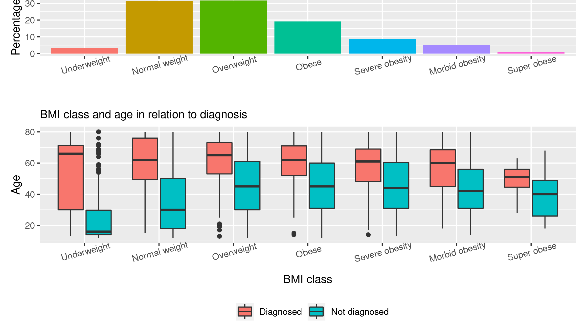
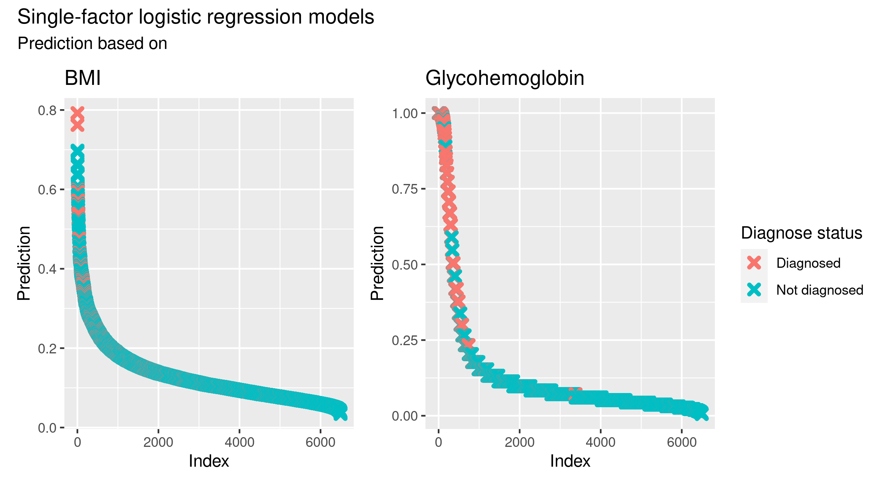
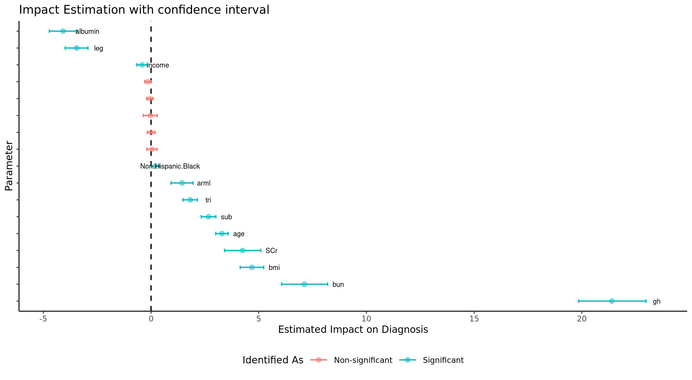
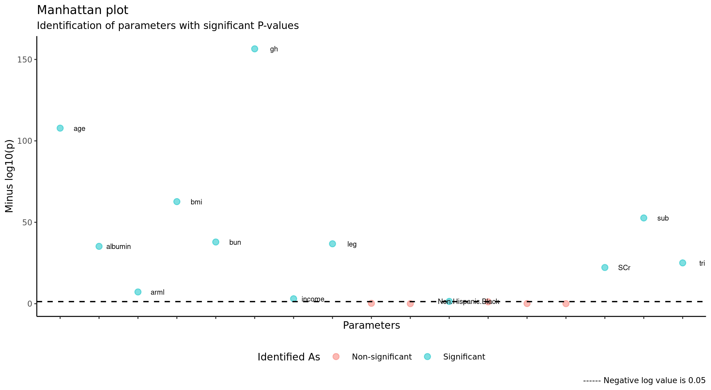
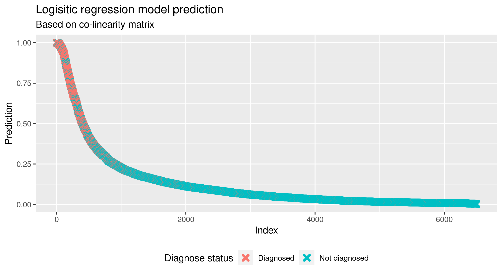

```{r setup, include=FALSE, message=FALSE}
library(knitr)
library(flextable)
library(kableExtra)
library('tidyverse')
knitr::opts_chunk$set(echo = FALSE)
```

## Introduction
- Diabetes is a prevalent disease worldwide 
- Huge amount of data available regarding diabetes
- Motivation: Use data to help understand which factors contribute to developing the disease

<!-- Line -->

# Materials

## NHANES glycohemoglobin data

<font size="4">National Health and Nutrition Examination Survey data concerning glycohemoglobin levels and diabetes mellitus (DM) from https://hbiostat.org/data/.</font>

<font size="4">**Why this dataset?**</font>

- <font size="3">Managable size: 20 variables, 6795 observations</font>
- <font size="3">Wide spectrum of variables</font>
- <font size="3">Contains missing values to handle</font>
- <font size="3">Explore correlations between diagnosis with DM and the other variables</font>

<!-- Melanie -->


## Variable types

```{r echo=FALSE, message=FALSE}
my_data_raw <- read_tsv(file = "../data/_raw/nhgh.tsv")
variables_described <- colnames(my_data_raw) %>% 
  tibble %>% 
  rename(Variable = ".") %>% 
  mutate(Description = c("Unique patient ID", "Gender", "Age", "Race/ethnicity", "Family income level",
                        "On Insulin or Diabetes meds", "Diagnosed with DM or pre-DM",
                        "Weight", "Height", "Body-mass index", "Upper leg length", 
                        "Upper arm length", "Arm circumference", "Waist circumference",
                        "Triceps skinfold thickness", "Subscapular skinfold thickness",
                        "Glycohemoglobin", "Albumin", "Blood urea nitrogen", "Serum Creatinine"
                        ),
         Units = c("", "", "Years", "", "$",
                   "", "", 
                   "kg", "cm", "kg/m^2", "cm",
                   "cm", "cm", "cm",
                   "mm", "mm",
                   "%", "g/dL", "mg/dL", "mg/dL"),
         Levels = c("", "0, 1", "12 - 80", "5 levels: White, Black, Mexican, Other Hispanic, Other", "14 levels from 0 - 100000",
                  "0, 1", "0, 1", 
                  "28 - 239.4", "123.3 - 202.7", "13.18 - 84.87", "20.4 - 50.6",
                  "24.8 - 47", "16.8 - 61", "52 - 179", 
                  "2.6 - 41.1", "3.8 - 40.4", 
                  "4 - 16.4", "2.5 - 5.3", "1 - 90", "0.14 - 15.66"))
``` 

```{r}
variables_described %>% 
  kable() %>%
  kable_styling(bootstrap_options = c("striped", 
                                      "condensed"), 
                font_size = 10) %>% 
  row_spec(row = 6:7, background = 'lightgreen') %>% 
  row_spec(row = 8:16, background = 'lightblue') %>% 
  row_spec(row = 17:20, background = 'pink')
  
```
DX does not differentiate between type I and type II

<!-- Melanie -->

# Methods

## Data journey
{width=100%}

<!-- Casper -->

## Data cleaning - Imputation of NAs

```{r}
variables_described %>% 
  filter(Variable == "income") %>% 
  kable() %>%
  kable_styling(bootstrap_options = c("striped", 
                                      "condensed"), 
                font_size = 10) %>% 
  row_spec(row =1, background = 'pink')
```
<font size="4">Here we assigned the mean from all non-NA values of income.</font>


```{r}
variables_described %>% 
  slice(11:16) %>% 
  kable() %>%
  kable_styling(bootstrap_options = c("striped", 
                                      "condensed"), 
                font_size = 10) %>% 
  row_spec(row = 1:6, background = 'lightgreen')
```

<font size="4">Here we implemented KNN (K=5) in tidyverse. We did not optimize K.</font>

<!-- Casper -->

## Data cleaning - Removal of outliers

{width=75%}

<font size="4">Biochemical variables have more outliers</font>

```{r}
variables_described %>% 
  slice(20) %>% 
  kable() %>%
  kable_styling(bootstrap_options = c("striped", 
                                      "condensed"), 
                font_size = 10)
```

<font size="4">Normal range is 0.6 - 1.2 mg/dL, 5+ indicates severe kidney impairment. We removed all values above 5 (17 total values).</font>
<font size="2">Source: https://www.medicinenet.com/creatinine_blood_test/article.htm</font>

<!-- Casper -->

# Results & Discussion

## Explorative data analysis

<font size="4">Linear correlation between numeric variables</font>
<div class = "columns-2">

{width=100%, height=100%}

<br>
<br>
<font size="4">Positive correlations primarily betweeen body-size related variables.</font>


</div>

<!-- Tram -->

## Explorative data analysis

<font size="4">Weight and obesity levels as a contributing factor to diagnosis</font>


{width=100%}


<!-- Tram -->

## Explorative data analysis

<font size="4">Age as a contributing factor to diagnosis across BMI class</font>


{width=100%}

<!-- - Older individuals tend to be diagnosed to a greater extent compared to younger individuals.  -->
<!-- - Increasing obesity levels seem to negatively influence the age of diagnosis.  -->

<!-- Tram -->

## Explorative data analysis

<font size="4">Treatment status of different ethnicity and age</font>


{width=100%, height=70%}

- <font size="4">Older individuals tend to receive treatment to a larger extent compared to younger individuals.</font>
- <font size="4">No correlation between treatment status and ethnicity.</font>

<!-- Tram -->


## Explorative data analysis

<font size="4">Serum albumin levels in relation to diagnosis</font>

{width=100%, height=70%}
<font size="4">Serum albumin is lower in diagnosed compared to non-diagnosed individuals.</font>

<!-- Line -->

## Principal Component Analysis
<font size="4">Investigation of patterns concerning diagnosis of diabetes mellitus</font>

{width=100%}

<font size="4">Variables dx, tx, leg, arml, wt and ht were excluded</font>

<!-- Line -->

## K-means clustering 

<font size="4">Identify relevant number of clusters</font>

{width=95%}

<!-- Melanie -->

## K-means clustering

<font size="4">Clusters between age and all other variables</font>

{width=100%}

<!-- Melanie -->

## Single Parameter Logistic Regression

<font size="4"> Performing single parameter evaluation to have a baseline</font>


{width=100%}

<font size = "2"> The precision of the BMI & GH is 29% and 68% respectively</font>

<!-- Varun -->

## Parameter Impact Estimation

{width=100%}

<!-- Varun -->

## Parameters vs P-value

{width=100%}

<!-- Varun -->

## Multi-Factorial Logistic Regression

{width=100%}

<font size = "2"> The precision of this model is at 80%</font>

<!-- Varun -->

## Conclusion 

- <font size="4">Diagnosis of DM correlates with age, blood glucose, bmi, albumin and to some degree BUN</font>
- <font size="4">Income, ethnicity and gender does not appear to predict DM diagnosis or treatment status</font>
- <font size="4">Blood glucose overrules other variables in predicting DM diagnosis</font>


<font size="4">In summary: We cannot cluster patients based on these variables alone</font>

<font size="4">Idea for further research:</font>
<font size="4">Appears that older people who have diabetes tend to be treated more often than younger people with diabetes</font>

<!-- Melanie -->
