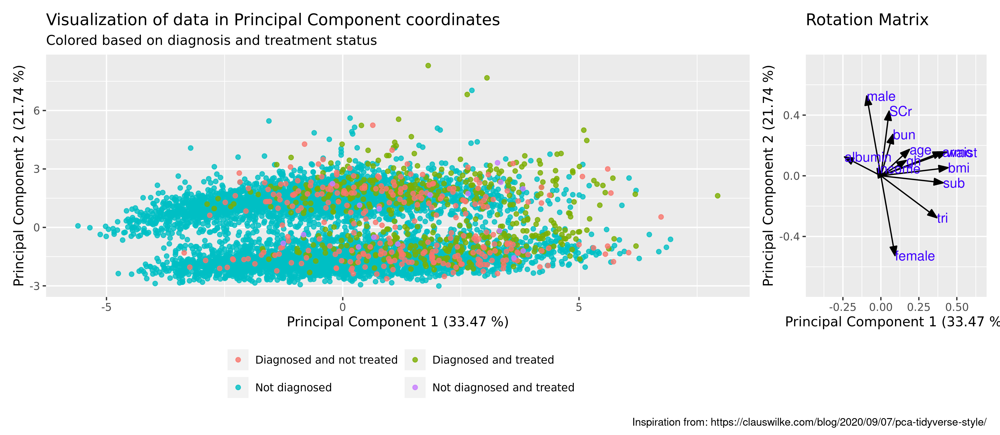

```{r setup, include=FALSE, message=FALSE}
library(knitr)
library(flextable)
library(kableExtra)
library('tidyverse')
knitr::opts_chunk$set(echo = FALSE)
```

## Introduction

Learning to use tidyverse for data exploration and modelling and bla bla

# Materials

## NHANES glycohemoglobin data

<font size="4">National Health and Nutrition Examination Survey data concerning glycohemoglobin levels and diabetes mellitus (DM) from https://hbiostat.org/data/.</font>

<font size="4">**Why this dataset?**</font>

- <font size="3">Managable size: 20 variables, 6795 observations</font>
- <font size="3">Wide spectrum of variables</font>
- <font size="3">Contains missing values to handle</font>
- <font size="3">Explore correlations between diagnosis with DM and the other variables</font>


## The data

```{r echo=FALSE, message=FALSE}
my_data_raw <- read_tsv(file = "../data/_raw/nhgh.tsv")
variables_described <- colnames(my_data_raw) %>% 
  tibble %>% 
  rename(Variable = ".") %>% 
  mutate(Description = c("Unique patient ID", "Gender", "Age", "Race/ethnicity", "Family income level",
                        "On Insulin or Diabetes meds", "Diagnosed with DM or pre-DM",
                        "Weight", "Height", "Body-mass index", "Upper leg length", 
                        "Upper arm length", "Arm circumference", "Waist circumference",
                        "Triceps skinfold thickness", "Subscapular skinfold thickness",
                        "Glycohemoglobin", "Albumin", "Blood urea nitrogen", "Serum Creatinine"
                        ),
         Units = c("", "", "Years", "", "$",
                   "", "", 
                   "kg", "cm", "kg/m^2", "cm",
                   "cm", "cm", "cm",
                   "mm", "mm",
                   "%", "g/dL", "mg/dL", "mg/dL"),
         Levels = c("", "0, 1", "12 - 80", "5 levels: White, Black, Mexican, Other Hispanic, Other", "14 levels from 0 - 100000",
                  "0, 1", "0, 1", 
                  "28 - 239.4", "123.3 - 202.7", "13.18 - 84.87", "20.4 - 50.6",
                  "24.8 - 47", "16.8 - 61", "52 - 179", 
                  "2.6 - 41.1", "3.8 - 40.4", 
                  "4 - 16.4", "2.5 - 5.3", "1 - 90", "0.14 - 15.66"))
```


```{r}
variables_described %>% 
  kable() %>%
  kable_styling(bootstrap_options = c("striped", 
                                      "condensed"), 
                font_size = 10)
```

## Variable types

```{r}
variables_described %>% 
  kable() %>%
  kable_styling(bootstrap_options = c("striped", 
                                      "condensed"), 
                font_size = 10) %>% 
  row_spec(row = 6:7, background = 'lightgreen') %>% 
  row_spec(row = 8:16, background = 'lightblue') %>% 
  row_spec(row = 17:20, background = 'pink')
  
```
DX does not differentiate between type I and type II

## Variables containing NAs

```{r}
variables_described %>% 
  kable() %>%
  kable_styling(bootstrap_options = c("striped", 
                                      "condensed"), 
                font_size = 10) %>% 
  row_spec(row =5, background = 'pink') %>% 
  row_spec(row = 11:16, background = 'lightgreen')
  
```

# Methods

## Data journey
{width=100%}

## Data cleaning - Imputation of NAs

```{r}
variables_described %>% 
  filter(Variable == "income") %>% 
  kable() %>%
  kable_styling(bootstrap_options = c("striped", 
                                      "condensed"), 
                font_size = 10) %>% 
  row_spec(row =1, background = 'pink')
```
Here we assigned the mean from all non-NA values of income.


```{r}
variables_described %>% 
  slice(11:16) %>% 
  kable() %>%
  kable_styling(bootstrap_options = c("striped", 
                                      "condensed"), 
                font_size = 10) %>% 
  row_spec(row = 1:6, background = 'lightgreen')
```

Here we implemented KNN (K=5) in tidyverse. We did not optimize K.

## Data cleaning - Removal of outliers

{width=100%}

Biochemical variables have more outliers

```{r}
variables_described %>% 
  slice(20) %>% 
  kable() %>%
  kable_styling(bootstrap_options = c("striped", 
                                      "condensed"), 
                font_size = 10)
```

Normal range is 0.6 - 1.3 mg/dL, 5+ indicates severe kidney impairment. We removed all values above 5 (17 total values).


# Results & Discussion

## DATA VISUALIZATION


## Principal Component Analysis
Investigation of patterns concerning diagnosis of diabetes mellitus

{width=100%}

Variables dx, tx, leg, arml, wt and ht were excluded


## Principal Component Analysis

### Investigation of patterns in relation to BMI

{width=100%}


Variables bmi, wt and ht were excluded

## K-means clustering 
### Identify relevant number of clusters
{width=100%}


## K-means clustering
### CLusters between age and all other variables
{width=100%}

## Conclusion 


